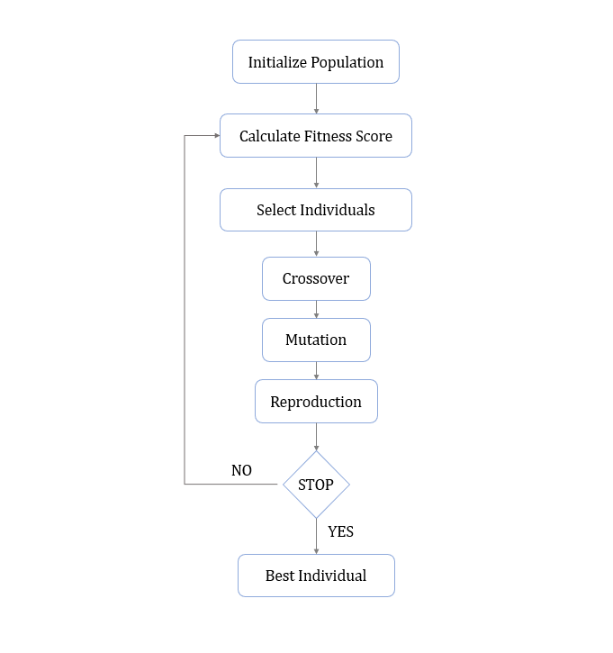
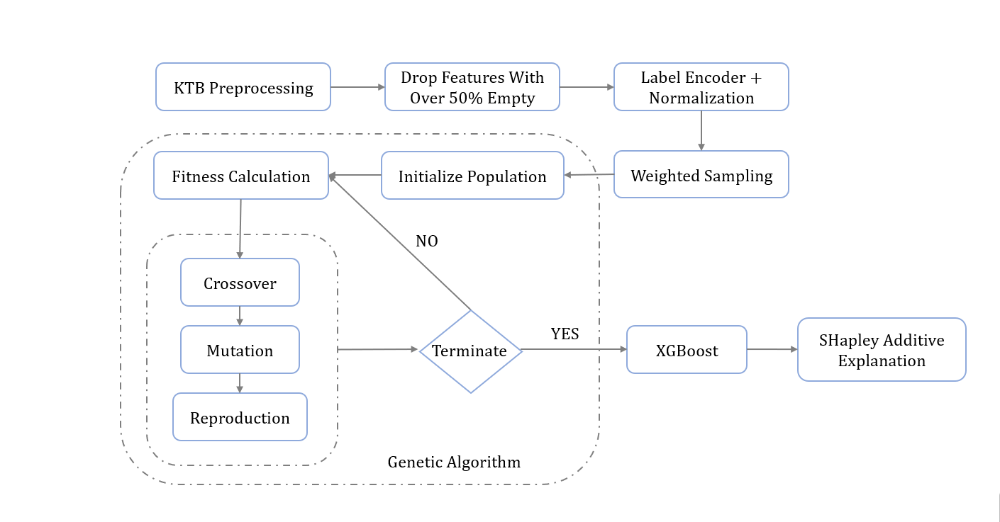
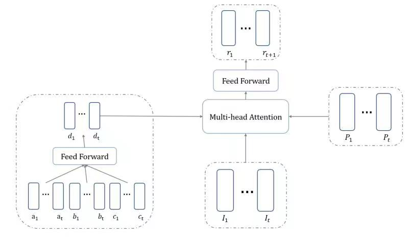

# GASA-KNOWLEDGE-TRACING
 GENETIC ALGORITHM AND SELF ATTENTION FOR KNOWLEDGE TRACING
The model based on genetic algorithm and self attention mechanism

The model primarily analyzed massive online education datasets and proposed agile deep learning model based on attention mechanism
and genetic algorithm, to predict students’ future learning result and facilitate online learning with education platform.
Skills: neural network model development, large-scale dataset processing & analysis, Python, PyTorch, SQL, Latex.

